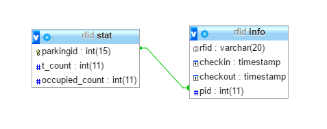
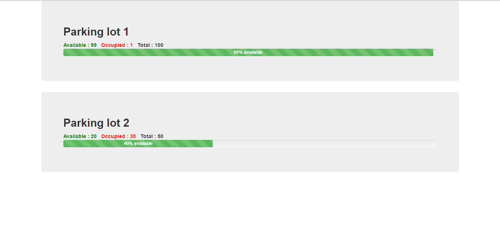

# Smart Parking
>Get the availablity status of parking lots online and save your fuel!

### Prerequisites
#### Software
* [Node js](https://nodejs.org/)
* [Mysql](https://www.mysql.com/)
* Arduino 1.6.7 IDE & ESP8266 libraries

#### Hardware
* Nodemcu v2
* RFID reader & tags

### Installing
Install dependencies using ``` npm install``` in server directory.

### Database Schema

#### Triggers for schema
```SQL
DELIMITER |
CREATE TRIGGER INC 
  AFTER INSERT ON INFO 
    FOR EACH ROW
    BEGIN
    UPDATE STAT 
      SET OCCUPIED_COUNT = OCCUPIED_COUNT + 1
      WHERE PARKINGID = PID;
    END;
|
DELIMITER ;
DELIMITER |
CREATE TRIGGER DEC 
  AFTER UPDATE ON INFO 
    FOR EACH ROW
    BEGIN
    UPDATE STAT 
      SET OCCUPIED_COUNT = OCCUPIED_COUNT - 1
      WHERE PARKINGID = PID;
    END;
|
DELIMITER ;
```
### Screenshot


### License
This project is licensed under the MIT License - see the [License](License)
